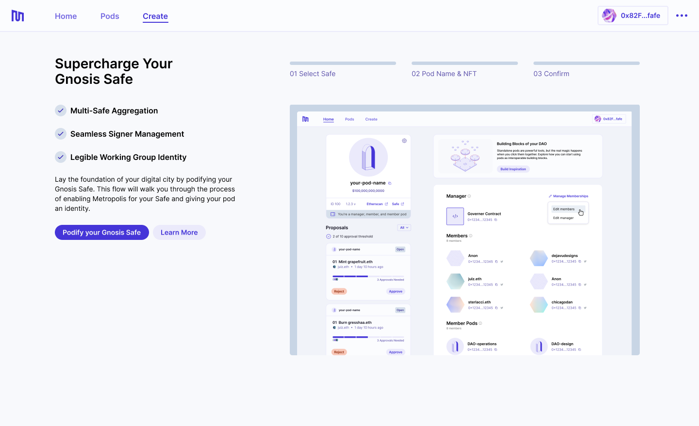
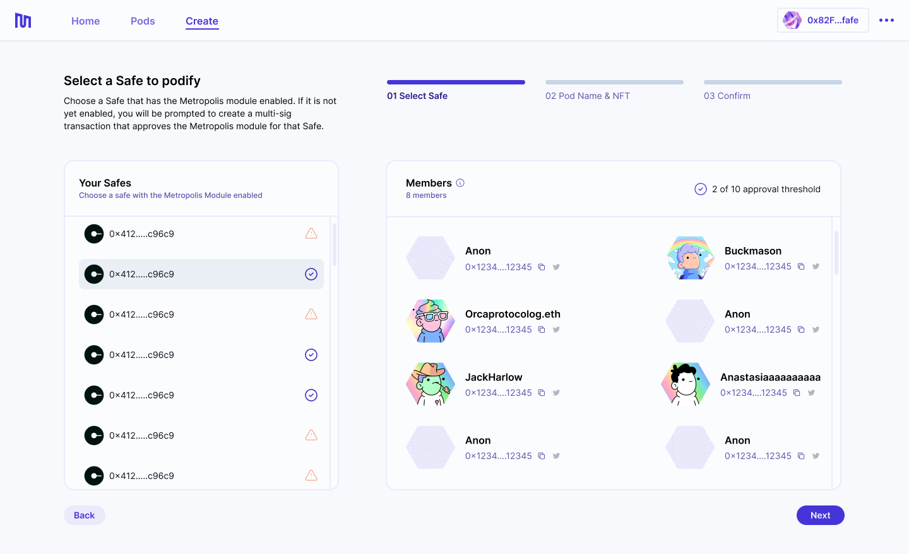
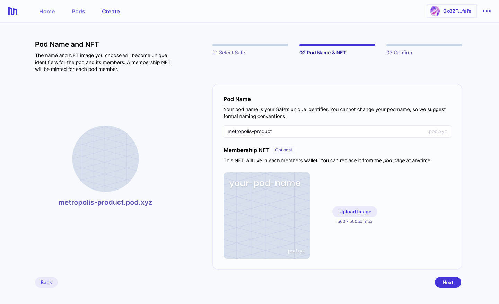
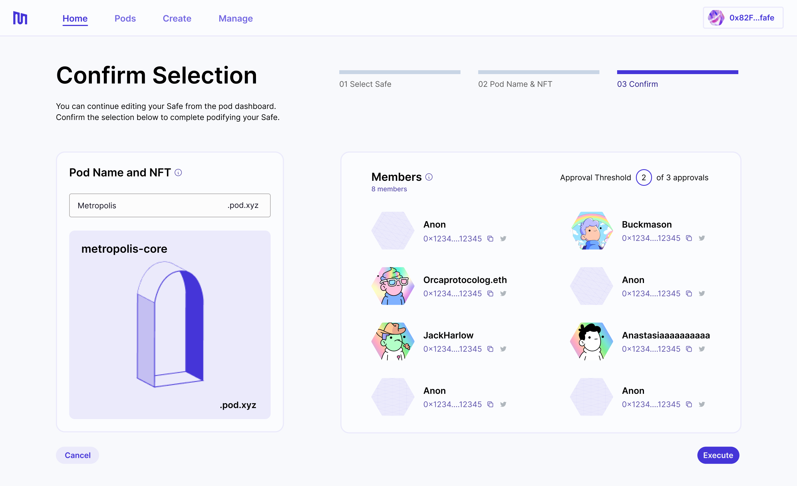

##### About podifying your Gnosis Safe.

---

## What Does Podifying Mean?

To enjoy the benefits that pods provide, your Gnosis Safe must first be *podified*. This simply means enabling the Metropolis smart contract as a module in the preferred Gnosis Safe. 

Podifying your Gnosis Safe is a necessary yet simple step to access all the [functionality](pod-basics/02-pod-benefits.md) in the Metropolis web app.

## How does the Metropolis module work?

When enabling the Metropolis module in your Gnosis Safe, note that:

- Metropolis does not interact with assets in the multi-sig—all Safe transactions still follow the same pathways;
- Metropolis does not remove functionality from Gnosis Safe—all of the original features remain available to you on the Gnosis Safe app;
- Metropolis does not give anyone access to your Gnosis Safe who is not already a signer when you enable the module;
- Metropolis’ contracts are periodically audited by independent parties to minimize smart contract risk.

## Steps To Podify Your Safe

Podifying a Gnosis Safe is straightforward. The Metropolis web app walks you through this process.

## 1. Check Build Permit NFT

To podify one of your Gnosis Safes, you must be a signer on a Safe that got airdropped a Build Permit NFT. Check if one of your Safes received a Build Permit NFT at [pod.xyz](http://pod.xyz/). 

## 2. Navigate to the Metropolis app

You can access the Metropolis web app at [pod.xyz/podify](https://pod.xyz/podify-safe). 

## 3. Start the Podifying Process

If you are eligible to podify, you will be greeted with the following screen. Hit *Podify your Gnosis Safe* to start.

## 4. Select Safe To Podify

You will be presented with a list of Gnosis Safes you are a signer on. The app will check if the Metropolis module is enabled in the Safes. If the Safe you select to podify does not have the module enabled, you will be prompted to create a Gnosis Safe transaction that does this. The Metropolis module must be enabled for each Safe that you intend to podify.

*Note: enabling the Metropolis module requires a multi-sig transaction.*

## 5. Choose a Pod Name & Image

The next step is to set the pod name and the image used for the membership NFT. The name of your pod will be used to create a subdomain of [pod.xyz](http://pod.xyz) (i.e. my-pod.pod.xyz), which will also become the ENS name of your pod.

The NFT image should have an aspect ratio of 1:1 and must be 800x800px or less.

## 6. Confirm

The final step is to confirm your selected Safe, pod name and NFT image. 

By default, the pod will be created without a pod manager. Learn more about [*Pod Roles and Membership*](pod-basics/03-pod-roles-membership.md).

If everything looks good, hit *Execute* to create a transaction that finalizes this process. Your pod page will be created and membership NFTs will be minted.

This step does *not* require a multi-sig transaction.

