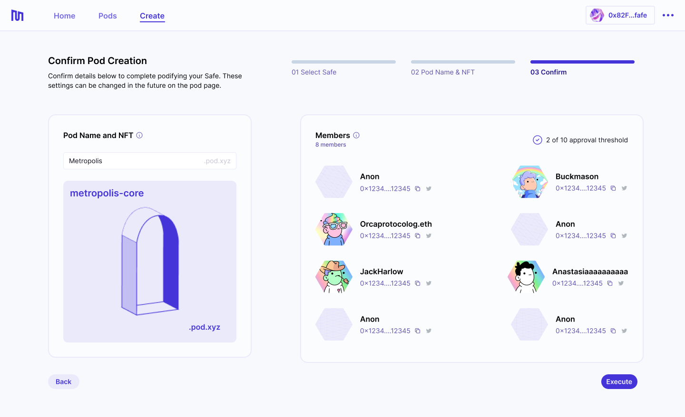

##### About podifying your Safe.

---

## What Does Podifying Mean?

To enjoy the benefits that pods provide, your Safe must first be _podified_. This simply means enabling the Metropolis smart contract as a module in the preferred Safe.

Podifying your Safe is a necessary yet simple step to access all the [functionality](docs/pod-basics/02-pod-benefits.md) in the Metropolis web app.

## How does the Metropolis module work?

When enabling the Metropolis module in your Safe, note that:

- Metropolis does not interact with assets in the multi-sig—all Safe transactions still follow the same pathways;
- Metropolis does not remove functionality from Safe—all of the original features remain available to you on the Safe app;
- Metropolis does not give anyone access to your Safe who is not already a signer when you enable the module;
- Metropolis’ contracts are periodically audited by independent parties to minimize smart contract risk.

### What risks are there with podifying my Safe?

- When podifying your Safe, you can choose to add a manager to your pod. The manager has certain privileges, such as the ability to add and remove members from the pod unilaterally. This could be used to take control of the pod's underlying Safe and its assets, so make sure the pod manager is trusted, or opt to not have a manager.
- Once a manager is set, only the manager can revoke or give someone else the manager role, i.e., pod members cannot remove a pod manager.
- After enabling the Metropolis module in your Safe, the module lock will be enabled, preventing other modules from being added. The module lock can be manually disabled by a pod manager, or by ejecting the pod.
- After enabling the Metropolis module, you will not be able to add a [Gnosis Transaction Guard](https://help.gnosis-safe.io/en/articles/5324092-what-is-a-transaction-guard) unless you eject the pod.

## Steps To Podify Your Safe

Podifying a Safe is straightforward. The Metropolis web app walks you through this process.

## 1. Check Build Permit NFT

To podify one of your Safes, you must be a signer on a Safe that got airdropped a Build Permit NFT. Check if one of your Safes received a Build Permit NFT at [pod.xyz](http://pod.xyz/).

## 2. Navigate to the Metropolis app

You can access the Metropolis web app at [pod.xyz/podify](https://pod.xyz/podify-safe).

## 3. Start the Podifying Process

If you are eligible to podify, you will be greeted with the following screen. Hit _Podify your Safe_ to start.

## 4. Select Safe To Podify

You will be presented with a list of Safes you are a signer on. The app will check if the Metropolis module is enabled in the Safes. If the Safe you select to podify does not have the module enabled, you will be prompted to create a Safe transaction that does this. The Metropolis module must be enabled for each Safe that you intend to podify.

_Note: enabling the Metropolis module requires a multi-sig transaction._

## 5. Choose a Pod Name & Image

The next step is to set the pod name and the image used for the membership NFT. The name of your pod will be used to create a subdomain of [pod.xyz](http://pod.xyz) (i.e. my-pod.pod.xyz), which will also become the ENS name of your pod.

The NFT image should have an aspect ratio of 1:1 and must be 800x800px or less.

## 6. Confirm

The final step is to confirm your selected Safe, pod name and NFT image.

By default, the pod will be created without a pod manager. Learn more about [_Pod Roles and Membership_](docs/pod-basics/03-pod-roles-membership.md).

If everything looks good, hit _Execute_ to create a transaction that finalizes this process. Your pod page will be created and membership NFTs will be minted.

This step does _not_ require a multi-sig transaction.

