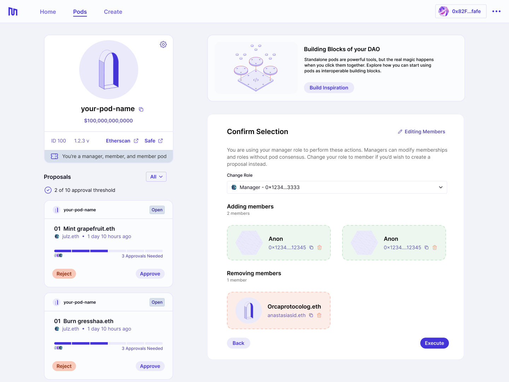
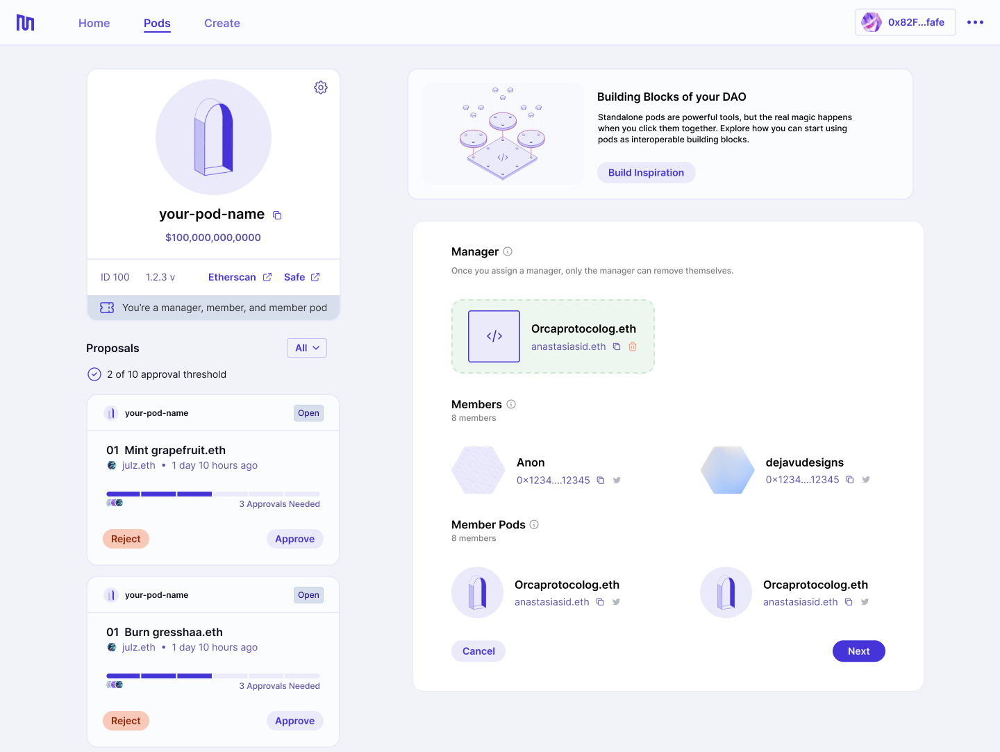
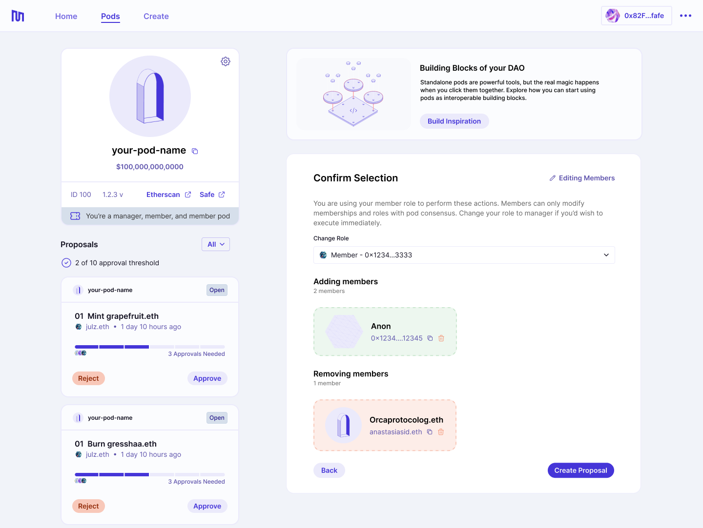

##### How to manage memberships for your pod.

---

There are a few ways in which membership can be managed for a pod:

- Add/remove members
- Adding a new pod manager
- Transferring membership/manager role

## Adding and removing members

You can choose to add or remove members from your pod. If you are a member of the pod or a member pod, this flow will result in a proposal submitted to the pod for approval. If you are a manager, you will have the rights to add or remove a member directly.

Members can be actual end users or other pods.

## Adding a pod manager

You can add a manager to your pod if one has not been set yet. This flow will result in a proposal being submitted to the pod for new pod manager approval. Managers cannot add additional managers - only transfer their manager keys.

Managers can be actual end users, other pods or smart contracts.

## Transferring membership / pod manager key

You can transfer your membership or pod manager key from within the pod page as well.

