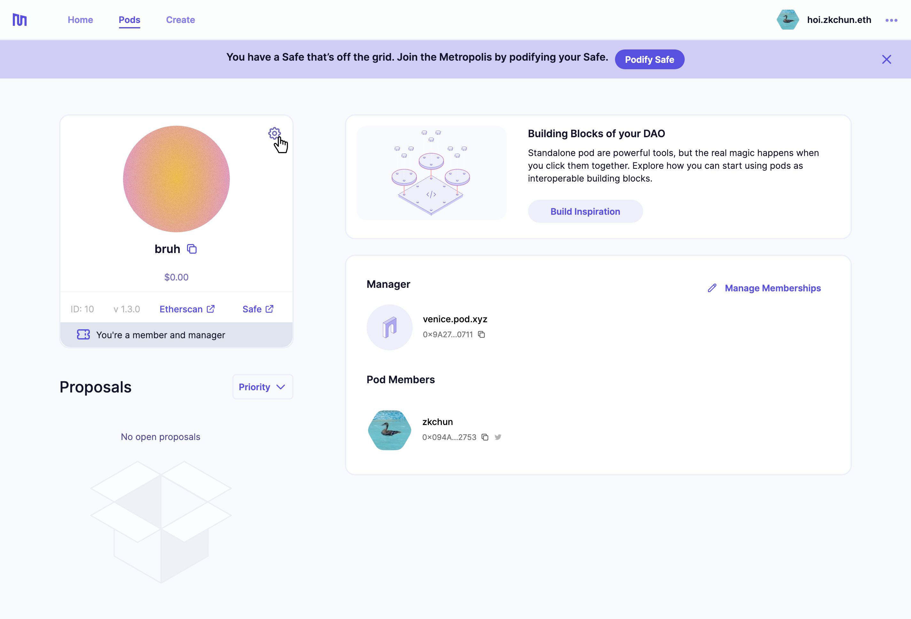
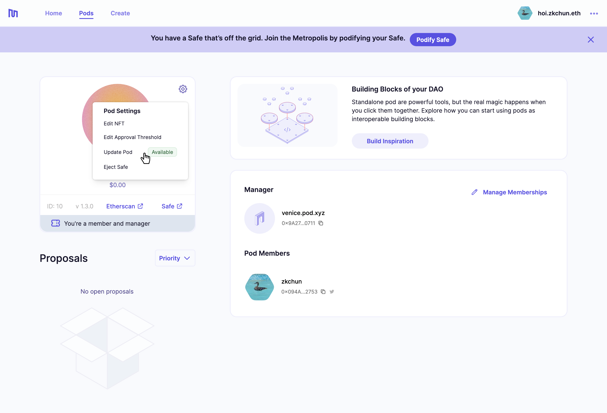
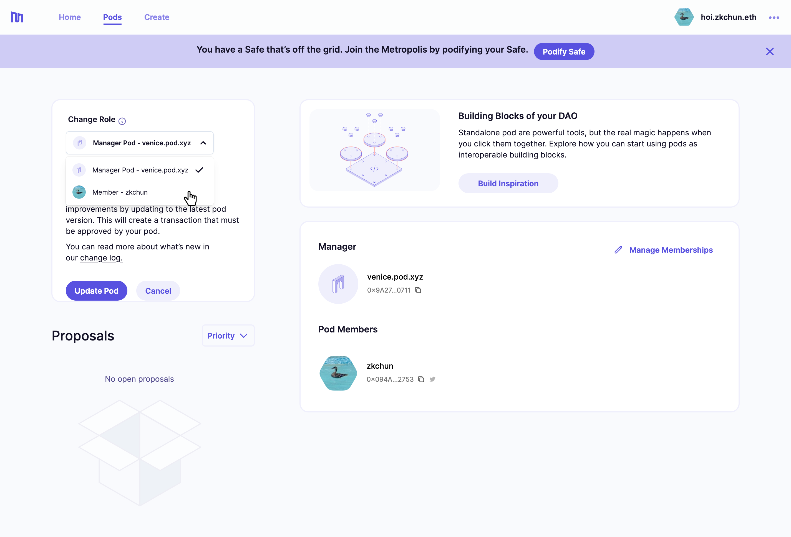
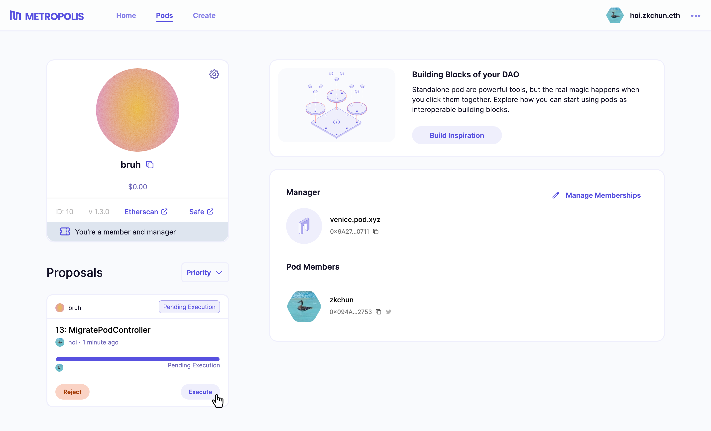

##### How to update your pod to the latest version.
---

Keeping your pod up-to-date ensures that you have access to the latest features and performance improvements. A transaction to update the pod version can be created from the pod settings menu. 

## 1. Go to pod page

On the pod page, open the pod settings menu.

## 2. Check for updates

If an update is ready, this will be indicated by a green box that says *"Available"*.

## 3. Select role

Both managers and members can update the pod version. Select the one appropriate for your pod, then hit *Update Pod*.

## 4. Gather consensus and execute

Once the threshold has been reached, the transaction to update the pod can be executed. This is an on-chain transaction, which means that the address that executes the transaction should have enough ETH to pay the gas fee.

