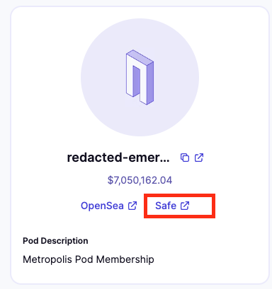
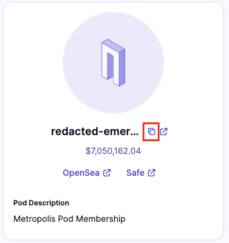
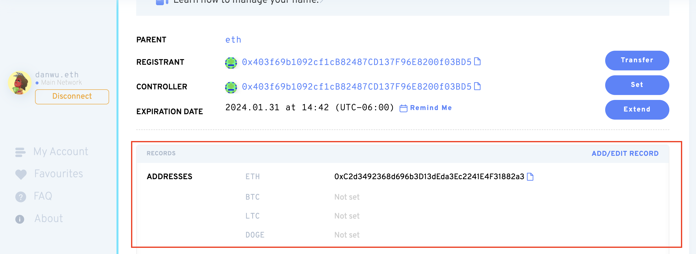
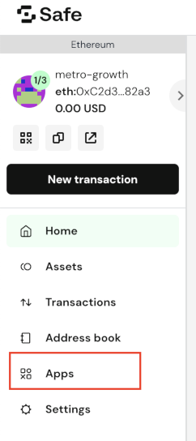
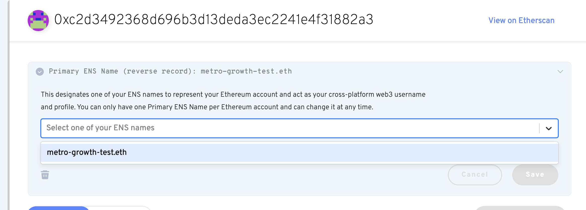

##### How to set a custom ENS name for your pod.
---

Changing the name of a pod is not yet supported in our app. But it is possible to set a custom ENS name for an existing pod while keeping all the functionality. To do this, follow the steps below. Note that you will need ETH for ENS registration and gas fees.

## 1. Buying an ENS name

1.a. If you are using an EOA to buy and set a new custom ENS for a pod, go to [app.ens.domains](https://app.ens.domains) and skip to step 3.

1.b. If you want an existing pod to be the controller for a ENS name, navigate to the Safe app for that pod:

2. Once in the Safe app, navigate to "Apps" in the side bar on the left and search for the ENS app. This will connect you to the ENS app as this pod (e.g., redacted-emergency.pod.xyz).
3. Search for an ENS name you like (e.g., redacted-core.eth).
4. Follow the steps on screen to register the ENS name.

## 2. Set ETH address record of new ENS name to pod

1. While connected to the wallet you used to buy the new ENS name, click on "My Account" in the sidebar on the left.
2. Select the ENS name you just registered (e.g., redacted-core.eth).
3. Copy the ETH address of the pod you want to rename. If this is an existing pod, you can find it on your pod page (e.g., pod.xyz/[YOUR POD NAME]):

4. Set this ETH address as the ETH record in the ENS app. In the example below, we're setting the ETH address record to *0xC2…82a3*:

## 3. Set custom ENS reverse record for pod

1. Go to [app.safe.global](https://app.safe.global), select the Safe of your pod and click on "Apps" in the sidebar:

2. Find the ENS app and select it. This will connect you to the ENS app as the Safe of your pod.
3. Click "My Account".
4. You should see a display box that says "Primary ENS Name (reverse record)". You should be able to select your new ENS name in the dropdown. Select it and confirm. Saving this change will create a multi-sig transaction for your Safe.

5. Once you've gathered enough signatures and have executed the transaction, the changes will be complete.