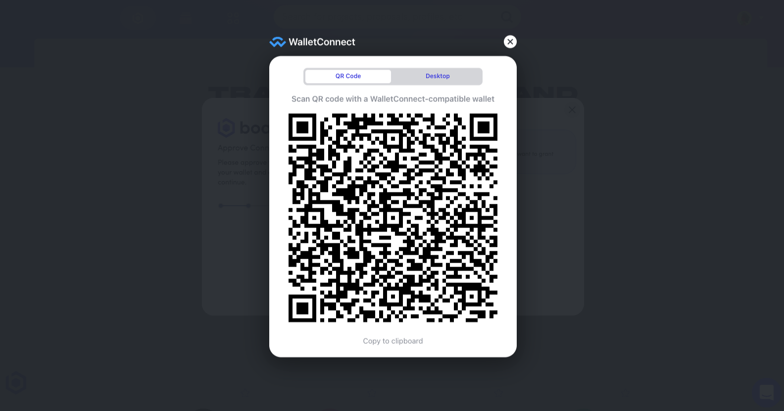
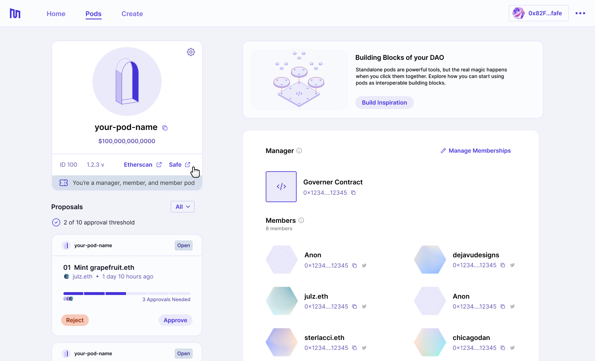
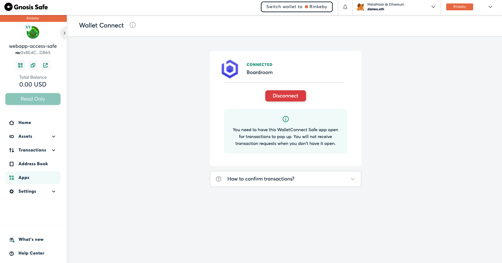
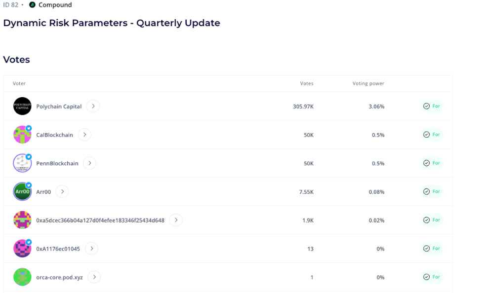

##### How to vote through your favorite governance platforms as a pod.
---

Meta-governance committees, delegate groups and simple working groups and can leverage pods to provide greater transparency and visibility for their entities by participating in governance and voting on proposals as a pod.

## 1. WalletConnect QR Code from Voting Platform
Access your preferred governance / voting platform of your choice (Boardroom, Tally, Messari Governor). Select "WalletConnect" and  copy the QR Code. 

## 2. Access Pod Safe UI
From your pod page, you can click the "Safe" button on the pod details component to access the Safe app.

## 3. Connect Wallet Connect in Safe UI
Navigate to "Apps" in Safe and find the WalletConnect app. Paste the WalletConnect QR code. You should receive confirmation that your Safe wallet is connected to the voting platform.

## 4. Vote On Proposal
Find the proposal you want to vote on and cast your vote. You will need to confirm the transaction within the Safe UI.
Once your vote is cast, you should see your pod ENS name show up within the voting platform:

